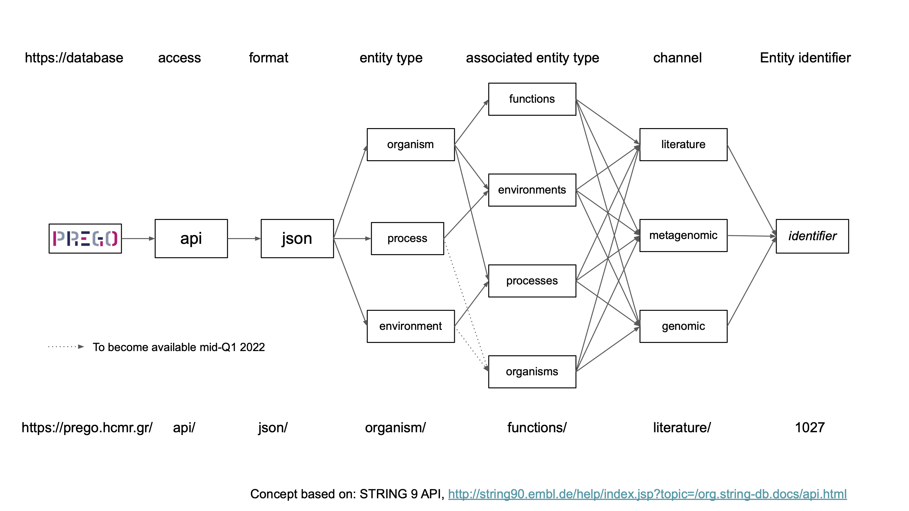

## Bulk download

| Channel                        | Link                                                              | md5sum                                |
|--------------------------------|-------------------------------------------------------------------|---------------------------------------|
| Literature                     |  https://prego.hcmr.gr/download/literature.tar.gz                 | literature.tar.gz.md5                 |
| Environmental samples          | https://prego.hcmr.gr/download/environmental_samples.tar.gz       | environmental_samples.tar.gz.md5      |
| Annotated genomes and isolates | https://prego.hcmr.gr/download/annotated_genomes_isolates.tar.gz  | annotated_genomes_isolates.tar.gz.md5 |

## API
All the PREGO associations can be accessed also through Application Programming Interface as shown in Figure below. 
The API follows the structure of PREGO with its different channels and different entity types.

