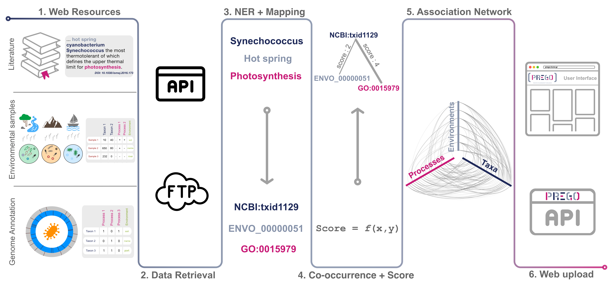

## Resources

The following data are retrieved at the backend of PREGO.

| Source                   | # items     | Data type                               | Metadata | License                           |
|--------------------------|-------------|-----------------------------------------|----------|-----------------------------------|
| MEDLINE and PubMed       | 33 million  | abstracts (text)                        | no       | NLM Copyright                     |
| PubMed Central OA Subset | 2.7 million | full article (text)                     | no       | CC for Commercial, non-commercial |
| JGI IMG                  | 9,644       | Isolates Annotated genomes              | yes      | JGI Data Policy                   |
| Struo                    | 21,276      | Annotated genomes                       | no       | MIT, CC BY-SA 4.0                 |
| BioProject               | 18,752      | Annotated genomes with abstracts (text) | yes      | INSDC policy                      |
| MG-RAST                  | 16,096      | markergene samples                      | yes      | CC0                               |
|                          | 7,965       | metagenomic samples                     | yes      | CC0                               |
| MGnify                   | 10,500      | markergene samples                      | yes      | CC-BY, CC0                        |

## Channels

PREGO’s contents are mainly divided into three distinct channels of information based on data origin and format.
The Literature channel exploits scientific publications, i.e. abstracts and full text open access scientific publications using text mining tools.
Through the Annotated Genomes and Isolates channel, PREGO retrieves genome annotations and their accompanying metadata.
Finally, the Environmental Samples channel supports the integration of metagenomic analyses (from both amplicon and shotgun studies); taxonomic and functional profiles along with their corresponding metadata. 

## Statistics

### Entities

The entities of PREGO after the NER and mapping of every source. Counts of distinct entities of Taxa, Environments (ENVO terms), Biological Processes (Gene Ontology Biological process) and Molecular Function (Gene Ontology Molecular Function).

| Channel                        | Source                   | Taxonomy |         | Environments | Biological Processes | Molecular Function |
|--------------------------------|--------------------------|----------|---------|--------------|----------------------|--------------------|
| Literature                     | MEDLINE PubMed - PMC OA  | Strains  | 8,929   | 1,077        | 15,079               | 7,318              |
|                                |                          | Species  | 240,377 |              |                      |                    |
|                                |                          | Total    | 342,506 |              |                      |                    |
| Environmental samples          | MG-RAST amplicon         | Strains  | 1,392   | 162          | -                    | -                  |
|                                |                          | Species  | 4,324   |              |                      |                    |
|                                |                          | Total    | 5,859   |              |                      |                    |
|                                | MG-RAST metagenome       | Strains  | 2,522   | 258          | -                    | 3,839              |
|                                |                          | Species  | 4,406   |              |                      |                    |
|                                |                          | Total    | 7,157   |              |                      |                    |
|                                | MGnify amplicon          | Strains  | 2       | 216          | 11                   |  -                 |
|                                |                          | Species  | 1,471   |              |                      |                    |
|                                |                          | Total    | 2,955   |              |                      |                    |
| Annotated Genomes and Isolates | JGI IMGisolates          | Strains  | 2,398   | 241          | -                    | 3,670              |
|                                |                          | Species  | 11,203  |              |                      |                    |
|                                |                          | Total    | 13,849  |              |                      |                    |
|                                | STRUO                    | Strains  | 6       | -            | -                    | 2,789              |
|                                |                          | Species  | 19,289  |              |                      |                    |
|                                |                          | Total    | 19,325  |              |                      |                    |
|                                | BioProject               | Strains  | 5,754   | 309          | 626                  | -                  |
|                                |                          | Species  | 3,373   |              |                      |                    |
|                                |                          | Total    | 9,393   |              |                      |                    |
| Total                          | All                      | Strains  | 12,840  | 1,090        | 15,091               | 7,971              |
|                                |                          | Species  | 258,352 |              |                      |                    |
|                                |                          | Total    | 364,508 |              |                      |                    |

### Associations

The associations between entities of PREGO after co-occurrence analysis. These supported entity types of associations are Environments - Biological Processes, Environments - Molecular Functions, Taxa - Environments, Taxa - Biological Processes, Taxa - Molecular Functions.

| Channel                        | Source                   | Environments - Processes | Environments - Functions | Taxonomy | Taxa - Environments | Taxa - Processes | Taxa - Function |
|--------------------------------|--------------------------|--------------------------|--------------------------|----------|---------------------|------------------|-----------------|
| Literature                     | MEDLINE PubMed - PMC OA  | 883,997                  | 422,579                  | Strains  | 69,968              | 590,630          | 384,079         |
|                                |                          |                          |                          | Species  | 778,877             | 3,501,635        | 1,961,920       |
|                                |                          |                          |                          | Total    | 1,669,608           | 7,969,310        | 4,613,827       |
| Environmental samples          | MG-RAST amplicon         | -                        | -                        | Strains  | 13,645              | -                | -               |
|                                |                          |                          |                          | Species  | 39,007              |                  |                 |
|                                |                          |                          |                          | Total    | 53,439              |                  |                 |
|                                | MG-RAST metagenome       | -                        | 620,846                  | Strains  | 262,106             | -                | 8,626,328       |
|                                |                          |                          |                          | Species  | 103,913             |                  | 10,715,548      |
|                                |                          |                          |                          | Total    | 372,301             |                  | 19,950,096      |
|                                | MGnify amplicon          | -                        | -                        | Strains  | 18                  | -                |                 |
|                                |                          |                          |                          | Species  | 30,122              | 351              | -               |
|                                |                          |                          |                          | Total    | 111,976             | 2,097            |                 |
| Annotated Genomes and Isolates | JGI IMGisolates          | -                        | -                        | Strains  | 8,229               | -                | 3,461,693       |
|                                |                          |                          |                          | Species  | 42,141              |                  | 13,216,559      |
|                                |                          |                          |                          | Total    | 50,888              |                  | 16,821,850      |
|                                | STRUO                    | -                        | -                        | Strains  | -                   | -                | 1,803           |
|                                |                          |                          |                          | Species  |                     |                  | 4,070,195       |
|                                |                          |                          |                          | Total    |                     |                  | 4,079,312       |
|                                | BioProject               | -                        | -                        | Strains  | 3,263               | 7,473            |                 |
|                                |                          |                          |                          | Species  | 4,187               | 4,294            |                 |
|                                |                          |                          |                          | Total    | 7,641               | 12,169           |                 |
| Total                          | All                      | 883,997                  | 1,043,425                | Strains  | 357,229             | 598,103          | 12,473,903      |
|                                |                          |                          |                          | Species  | 998,247             | 3,506,280        | 29,964,222      |
|                                |                          |                          |                          | Total    | 2,265,853           | 7,983,576        | 45,465,085      |

## Methodology

